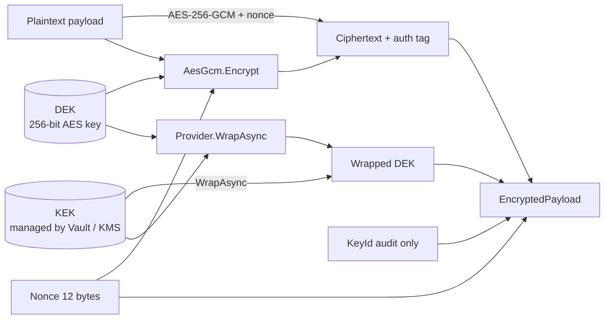
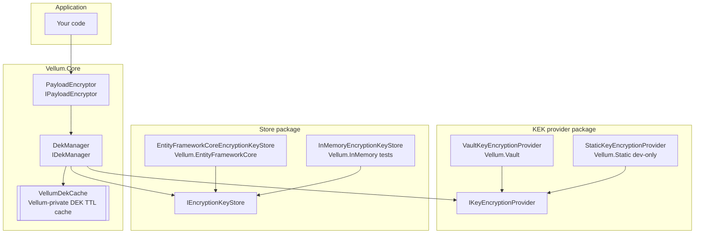
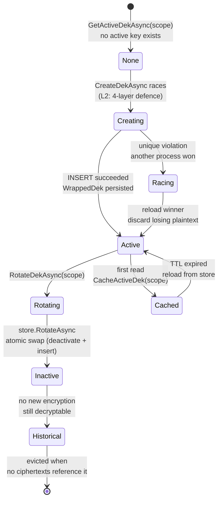

# Architecture

Vellum is a thin coordination layer over three well-known pieces: an authenticated cipher
(`System.Security.Cryptography.AesGcm`), a pluggable Key Encryption Key (KEK) provider, and a
pluggable wrapped-DEK store. This page explains how those pieces fit together, the
invariants they rely on, and why each design choice was made. Each section references the
internal lesson (L1–L24) that drove the decision — see
[the FAQ](faq.md) for a one-line context on any lesson you want to learn more about.

## Envelope encryption in one diagram

Envelope encryption is a two-key pattern: a fast symmetric **Data Encryption Key (DEK)**
encrypts the actual payload with AES-GCM, and a slower but better-protected
**Key Encryption Key (KEK)** — managed by a secure backend like HashiCorp Vault, AWS KMS, or
Azure Key Vault — wraps the DEK. Only the wrapped DEK is stored alongside the ciphertext.
Decryption requires access to the KEK backend to unwrap the DEK, then AES-GCM to undo the
payload encryption.



Everything highlighted as `ENV` — ciphertext, nonce, wrapped DEK, audit KeyId, plus a
`FormatVersion` field — goes into a single self-contained
[`EncryptedPayload`](../src/Vellum.Abstractions/EncryptedPayload.cs)
record. A consumer that persists an envelope stores it complete in a single row and
decrypts without any database lookup. This matches the design of the AWS Encryption SDK and
Google Tink.

By default the AES-GCM call also **binds the ciphertext to its scope** via associated data
(`UTF8("vellum:aad:v2:scope:" + scope)` — envelope format version 2). Decryption
reconstructs the same associated data from the caller-supplied scope, so an envelope
encrypted for tenant A presented as tenant B's data fails the authentication tag check
instead of decrypting. `VellumOptions.BindScopeToCiphertext` (default `true`) opts out to
the legacy unbound format version 1 when the scope is genuinely unavailable at decrypt
time.

The classical alternative is to store only the `KeyId` alongside the ciphertext and look up
the wrapped DEK in a side table on every decrypt. Vellum also supports that pattern (through
`IDekManager.GetDekByKeyIdAsync`), but `EncryptedPayload.KeyId` is **audit-only** when you
use the envelope path — the actual decrypt reads `WrappedDek` off the envelope. The `KeyId`
is kept for audit trails, rotation tracking, and the `"which DEK encrypted this row?"` query.

## The Vellum stack



Four layers, each one mockable at the interface level:

1. **`IPayloadEncryptor`** is the high-level API your code calls. It knows nothing about
   stores or caches; it just knows how to resolve an active DEK, run AES-GCM, and return a
   self-contained envelope.
2. **`IDekManager`** coordinates the store and the provider, handles race conditions on DEK
   creation and rotation (per-scope async lock + the 4-layer cross-process defence), and
   owns the DEK cache. The cache is a dedicated `VellumDekCache` — never the application's
   shared `IMemoryCache` — so other in-process code cannot read plaintext DEKs and consumer
   `SizeLimit` budgeting cannot evict them; key bytes are zeroed on eviction. Every cache
   hit path returns a `ValueTask<Dek>` so it stays synchronous and allocation-free.
3. **`IKeyEncryptionProvider`** wraps and unwraps DEKs against a secure backend. Vellum
   ships `Vellum.Vault` (HashiCorp Vault Transit) and `Vellum.Static` (dev-only). Cloud
   providers (`Vellum.AzureKeyVault`, `Vellum.AwsKms`, `Vellum.GcpKms`) are planned for
   `0.3.0`.
4. **`IEncryptionKeyStore`** persists wrapped DEKs. Vellum ships `Vellum.EntityFrameworkCore`
   for production and `Vellum.InMemory` for tests and samples.

Consumers pick **one provider** and **one store** package, call their `Add*` extensions, and
never touch the coordination layer in between.

## Key lifecycle

A DEK for a given scope goes through four states during its lifetime. The cache layer
shortcuts most reads, but the underlying state machine is:



- **None.** No active DEK exists for this scope yet. First-time encryption triggers
  creation.
- **Creating.** `DekManager.CreateDekAsync` generates 32 random bytes, wraps them through
  the KEK provider, and persists the wrapped record. This is the point at which the 4-layer
  race defence from [lesson L2](#race-safe-dek-creation) fires — see the sequence diagram
  below.
- **Racing.** If two consumers tried to create at the same time, the store's filtered
  unique index lets one win and rejects the other. The loser zeroes its own plaintext DEK,
  unwraps the winner's `WrappedKey`, and returns that.
- **Active.** Exactly one key per scope can be `IsActive = true` at any time. Subsequent
  encrypts for the same scope hit the DEK cache and never touch the store.
- **Rotating → Inactive.** `RotateDekAsync` generates and wraps the new DEK *first*, then
  swaps the active key via `IEncryptionKeyStore.RotateAsync` — deactivate-old plus
  insert-new in a single atomic transaction — and only then replaces (never removes) the
  cache entry. If the KEK provider or the store fails at any point, the old key stays
  active *and* cached: a scope is never observed without an active DEK. Historical rows
  encrypted with the previous DEK remain fully decryptable because envelopes are
  self-contained.
- **Historical.** An inactive DEK never participates in new encryptions. It stays in the
  store forever (or until you manually evict it) so that historical ciphertexts can still
  be decrypted. If you delete a historical DEK, every ciphertext that references it
  becomes unrecoverable.
- **Cached.** Any state transition that produces a plaintext DEK also populates the
  Vellum-private `VellumDekCache` (evicted, expired, or replaced entries have their key
  bytes zeroed). The cache entry TTL is `VellumOptions.DekCacheTtl` (default 30 minutes).
  Set it to `TimeSpan.Zero` to disable caching entirely — see
  [FAQ — What's the performance impact of the DEK cache?](faq.md#whats-the-performance-impact-of-the-dek-cache).

## Multi-tenant isolation

Vellum is multi-tenant by construction. The tenant boundary is an opaque `scope` string —
Vellum never interprets its content; the consumer picks the convention (`tenant:{id}`,
`bus:{id}`, `user:{id}`, …). The `scope` flows through **five layers**, and each layer
re-verifies it. A bug in any one layer does not compromise isolation because the others
still fire.

| Layer | Partitioning | Where |
|---|---|---|
| **Store** | `WHERE scope = @scope` on every read | `EntityFrameworkCoreEncryptionKeyStore.GetActiveAsync` / `GetByIdAsync` |
| **Store (historical defence)** | `WHERE keyId = @keyId AND scope = @scope` — a caller guessing a `Guid` cannot retrieve another tenant's key | [lesson L1](#where-to-find-lesson-references) — also bypasses tenant query filters so infrastructure DEKs are not tenant-filtered |
| **Cache** | `vellum:dek:active:{scope}` and `vellum:dek:id:{scope}:{keyId}` | `DekManager.BuildActiveCacheKey` / `BuildKeyIdCacheKey` — see [lesson L15](#where-to-find-lesson-references) |
| **Manager** | fast-path re-verification that cached `Dek.KeyId` matches the requested `KeyId` | `DekManager.GetDekByKeyIdAsync` belt-and-braces fail-closed (EventId 1003) |
| **Envelope (cryptographic)** | format version 2 ciphertexts carry the scope as AES-GCM associated data — an envelope moved between tenants fails the tag check at decrypt | `PayloadEncryptor.EncryptAsync` / `DecryptAsync`, `VellumOptions.BindScopeToCiphertext` |
| **Provider** | irrelevant — wrap/unwrap is symmetric over the KEK regardless of tenant | N/A |

> **Why re-verify scope on the cache fast path?** The cache key already contains the scope,
> so in principle a mismatch is impossible. The belt-and-braces check (`DekManager`, EventId
> 1003) still runs because a future refactor that breaks the cache-key-building invariant
> could otherwise leak a cross-tenant DEK silently. The explicit check guarantees that the
> only way a cross-tenant DEK can be returned is if the store itself is compromised, which
> in turn has its own defence via scope-in-WHERE-clause.

### The `WrappedKey` cache exception (L24)

The decrypt-path cache (`vellum:dek:wrapped:{sha256}`) deliberately omits the scope —
because the cache key derives from a SHA-256 hash of the wrapped ciphertext, which is
**itself the tenant-specific secret material**. Two different tenants that wrap the same
plaintext DEK against the same KEK produce different ciphertexts because the wrap
operation is authenticated and includes a random IV, so a hash of the ciphertext is a
globally unique tenant-safe identifier.

A consumer that does not already possess the wrapped ciphertext cannot guess another
tenant's cache key. This is the one place where Vellum's "cache keys must be
scope-partitioned" rule (L15) legitimately does not apply — and the asymmetry is documented
in [lesson L24](#where-to-find-lesson-references).

## Race-safe DEK creation (4-layer defence)

Two pods racing to create the first DEK for a brand-new scope is the single trickiest
scenario in the entire library, and the one that drove an entire post-mortem arc in the
source repository (lessons L1–L3, September–October 2025). Vellum's answer is four layers
of defence that run in order: three of them are inside
`DekManager.CreateDekAsync`, the fourth is inside
`EntityFrameworkCoreEncryptionKeyStore.CreateAsync`.

```mermaid
sequenceDiagram
    autonumber
    participant A as Pod A
    participant B as Pod B
    participant S as Store
    participant K as KEK provider

    par Concurrent creation
        A->>S: GetActiveAsync(scope)
        S-->>A: null
        A->>A: generate 32 random bytes
        A->>K: WrapAsync(dekA)
        K-->>A: WrappedKeyA
    and
        B->>S: GetActiveAsync(scope)
        S-->>B: null
        B->>B: generate 32 random bytes
        B->>K: WrapAsync(dekB)
        K-->>B: WrappedKeyB
    end
    A->>S: CreateAsync(scope, WrappedKeyA)
    S->>S: BEGIN; INSERT; COMMIT
    Note right of S: Layer 4 (store):<br/>filtered unique index<br/>enforces one active<br/>DEK per scope
    S-->>A: EncryptionKey { KeyId = A, ... }
    B->>S: CreateAsync(scope, WrappedKeyB)
    S->>S: BEGIN; INSERT → 23505 unique violation
    S->>S: detach failed entity<br/>from change tracker
    S->>S: SELECT winner<br/>.IgnoreQueryFilters()
    S-->>B: EncryptionKey { KeyId = A, ... }
    B->>B: wrap's KeyId != candidate KeyId<br/>→ race detected
    B->>B: CryptographicOperations.ZeroMemory(dekB)
    B->>K: UnwrapAsync(WrappedKeyA)
    K-->>B: dekA plaintext
    A-->>A: active = Dek(dekA, KeyIdA, WrappedKeyA)
    B-->>B: active = Dek(dekA, KeyIdA, WrappedKeyA)
    Note over A,B: Both pods now agree on the same active DEK.<br/>No duplicate, no data loss, no cross-tenant leak.
```

The four layers, numbered by the order in which they fire:

| # | Layer | Defence | Lesson |
|---|---|---|---|
| 1 | Manager | **Double-check via `GetActiveAsync` before generating.** Handles the easy case — another pod already finished, this pod has not even started wrapping. | L2 |
| 2 | Manager | **Try-wrap with `CryptographicOperations.ZeroMemory` on failure.** If wrap throws (network flap, token rotated, KEK revoked), the half-generated DEK bytes are scrubbed from memory before the exception propagates. | L2, L3 |
| 3 | Store | **`CreateAsync` catches `DbUpdateException` on the filtered unique index and returns the winner.** The failed candidate is detached from the `DbContext` change tracker so the next `SaveChangesAsync` on this context does not re-throw. | L2 |
| 4 | Store | **Winner re-read uses `.IgnoreQueryFilters()`.** This is the production incident that drove lesson L1 — without it, a global tenant query filter on the `DbContext` could filter the winner out and make the loser believe no DEK exists at all. | L1 |

All four layers are exercised by the concurrency test suite
(`ConcurrentCreateAsync_SameScope_OnlyOneWinner_ViaUniqueIndex` in
`Vellum.EntityFrameworkCore.Tests`), which runs 8 contexts in parallel against a shared
temporary SQLite file (see lesson L21 for why not `:memory:`).

Since `0.2.0`, a **per-scope async lock** (`SemaphoreSlim` per scope, cache-hit fast path
stays lock-free) is shared between the create, rotate, and slow-read paths inside a single
process. It eliminates the in-process variants of these races at the source — the cache
re-poisoning race where a slow in-flight read re-cached a freshly-deactivated DEK after a
rotation, the KEK-provider stampede where N concurrent cache misses each round-tripped to
Vault, and spurious "no concurrent winner" errors from create-vs-rotate interleavings. The
4-layer defence remains as the cross-process guarantee. A future release may additionally
adopt `pg_advisory_xact_lock` for PostgreSQL deployments — the 4-layer design is
provider-agnostic and works on every major relational backend, but the advisory-lock
approach would be simpler where it is supported.

## Memory hygiene

Plaintext DEK bytes are sensitive and must leave memory as soon as possible. Vellum takes
five concrete steps:

1. **Clone before return.** Every path that returns a `Dek` from the cache returns a fresh
   `new Dek((byte[])source.Key.Clone(), ...)`. Callers are free to
   `CryptographicOperations.ZeroMemory(dek.Key)` without corrupting the cache entry — see
   [lesson L3](#where-to-find-lesson-references) for the production incident that made this
   mandatory.
2. **Zero in `finally`.** `PayloadEncryptor.EncryptAsync` and `DecryptAsync` both run
   `CryptographicOperations.ZeroMemory(dek.Key)` in a `finally` block after the AES-GCM
   operation, whether it succeeded or threw.
3. **Zero on race loss.** If `DekManager.CreateDekAsync` loses a race, the plaintext DEK
   it generated but never persisted is zeroed before unwrapping the winner.
4. **Zero on wrap failure.** If `IKeyEncryptionProvider.WrapAsync` throws, the freshly
   generated plaintext DEK is zeroed before the exception propagates.
5. **Zero on cache eviction.** Every `VellumDekCache` entry carries a post-eviction
   callback that scrubs the cached key bytes when the entry is evicted, expired, or
   replaced, and the cache compacts itself on dispose so all remaining plaintext DEKs are
   scrubbed at shutdown.

Vellum does **not** try to defeat memory scanning or forensic tooling — a sufficiently
privileged attacker with a kernel debugger or a process dump can read the DEK bytes while
they are alive. The goal is to minimise the window during which plaintext key material is
live in the heap, not to make it impossible to observe.

`Dek.ToString()` and `EncryptedPayload.ToString()` are also overridden to return a fixed
safe summary (lengths only) so that a consumer that naively logs one of these records does
not leak key material. This is belt-and-braces: the current compiler-generated `ToString`
happens to print `byte[]` as `"System.Byte[]"`, which is also safe, but the explicit
override pins the invariant regardless of future compiler behaviour.

## Why no custom crypto

Vellum delegates every cryptographic primitive to `System.Security.Cryptography`:

- **Authenticated encryption.** `AesGcm` from the BCL, configured with a 12-byte nonce and
  a 16-byte authentication tag.
- **Random bytes.** `RandomNumberGenerator.Fill` through an abstraction
  (`IRandomBytesProvider`) that tests can swap out, but the default is the BCL CSPRNG.
- **SHA-256.** `SHA256.HashData` for the cache key derived from wrapped ciphertexts.
- **Zeroing.** `CryptographicOperations.ZeroMemory(Span<byte>)`.

**None of these are implemented inside Vellum.** The policy, captured in
[lesson L4](#where-to-find-lesson-references), is "NEVER write custom crypto". Cryptographic
bugs are catastrophic and silent — the only reliable way not to have one is to never write
cryptographic code in the first place. Vellum's job is to coordinate well-reviewed primitives
from the BCL, not to compete with them.

This means two things in practice:

- Vellum will never expose a "pluggable cipher" — AES-GCM is the only authenticated
  encryption it supports. If your threat model requires a different cipher (ChaCha20-Poly1305,
  XChaCha20, …), Vellum is the wrong library.
- Vellum will never ship a KEK backend that holds the KEK in process memory long-term beyond
  the dev-only `Vellum.Static` provider. Even `Vellum.Static` exists mostly to make the
  test and sample paths runnable without Vault — it loudly warns on every startup and is
  flagged "development use only" in every piece of documentation that mentions it.

## Provider-agnostic design

`IKeyEncryptionProvider` is the only seam between Vellum and a secure backend. It has
three methods:

```csharp
Task<WrappedKey> WrapAsync(ReadOnlyMemory<byte> dek, CancellationToken cancellationToken = default);
Task<byte[]> UnwrapAsync(WrappedKey wrappedKey, CancellationToken cancellationToken = default);
Task<WrappedKey> RewrapAsync(WrappedKey wrappedKey, CancellationToken cancellationToken = default);
```

`RewrapAsync` re-encrypts a wrapped DEK under the provider's current KEK version without
exposing the plaintext to the caller — `Vellum.Vault` uses Transit's native `/rewrap`
endpoint, so the plaintext never leaves Vault. It backs the KEK-retirement tooling
(`VellumRewrapService`, `IPayloadEncryptor.RewrapPayloadAsync`) documented in the
[key rotation runbook](kek-rotation.md).

Everything else Vellum does — cache, scope, store, rotation — works identically regardless
of which backend is plugged in. The current and planned providers are:

| Package | Backend | Status |
|---|---|---|
| `Vellum.Vault` | HashiCorp Vault Transit secrets engine | Shipped |
| `Vellum.Static` | Static in-process AES-256-GCM KEK (dev only) | Shipped |
| `Vellum.AzureKeyVault` | Azure Key Vault wrap/unwrap via `Azure.Security.KeyVault.Keys` | Planned `0.3.0` |
| `Vellum.AwsKms` | AWS KMS `Encrypt`/`Decrypt` via `AWSSDK.KeyManagementService` | Planned `0.3.0` |
| `Vellum.GcpKms` | GCP KMS `Encrypt`/`Decrypt` via `Google.Cloud.Kms.V1` | Planned `0.3.0` |

> **Not overclaiming.** The three cloud providers listed above are **not yet shipped**. If
> you need them today, they are straightforward to write against the interface (
> [`src/Vellum.Vault/VaultKeyEncryptionProvider.cs`](../src/Vellum.Vault/VaultKeyEncryptionProvider.cs)
> is 270 lines and is the reference implementation), and contributions upstream are
> welcome. Until `0.3.0` ships, Vellum officially supports Vault Transit for production
> workloads only.

### The Vault HTTP pipeline

`Vellum.Vault` builds its typed `HttpClient` as a small handler pipeline. The standard
HTTP **resilience handler** (retries on transient failures with exponential backoff,
circuit breaker, per-attempt and total timeouts derived from `VaultOptions.HttpTimeout`)
is outermost and enabled by default (`EnableResilience = false` opts out). Inside it sits
the **authentication handler** (`VaultAuthenticationHandler`), which fetches the token per
request from `IVaultTokenProvider` and stamps the `X-Vault-Token` header — so every retry
attempt gets a fresh-token opportunity. A `403` invalidates the cached token and retries
exactly once with a fresh one. Two token providers ship: `StaticVaultTokenProvider` (a
fixed token) and `AppRoleVaultTokenProvider` (AppRole login with a cached token,
automatically re-acquired at `TokenRenewalThreshold` — 80 % of the lease by default);
consumers can register their own `IVaultTokenProvider` for other Vault auth methods.

A note on `WrappedKey.ProviderVersion`: the field is a `string`, not an `int`, because
every cloud provider uses a different version identifier format. HashiCorp Vault returns
`"v1"` / `"v2"`; AWS KMS returns full ARNs; Azure Key Vault returns key URIs containing a
GUID; GCP KMS returns nested resource paths. A `string` accommodates all four without a
single breaking change — see [lesson L14](#where-to-find-lesson-references).

## Where to find lesson references

Vellum's XML documentation cross-references internal lessons `L1` through `L24` as
`tasks/lessons.md L<number>`. Those paths live in the development repository and are not
published with the NuGet packages. The FAQ has a one-line summary of every lesson referenced
from the public docs, and the source code keeps the full context inline next to the logic
that embodies each lesson:

| Lesson | One-line summary | Referenced from |
|---|---|---|
| L1 | `IgnoreQueryFilters()` on every read in `IEncryptionKeyStore` — DEKs are infrastructure, not domain data | `IEncryptionKeyStore.GetByIdAsync` XML remarks |
| L2 | Race-safe DEK creation uses 4 layers: double-check, wrap-with-zeroize, unique-index, re-read winner | `DekManager.CreateDekAsync` inline comments |
| L3 | Caches must clone `byte[]` before returning so callers can safely zero their copy | `DekManager.CloneDek` |
| L4 | Never write custom crypto. Delegate to `System.Security.Cryptography` exclusively. | design principle in README |
| L5 | Libraries use `ConfigureAwait(false)` everywhere to avoid sync-context deadlocks | every `await` in `src/Vellum.*` |
| L6 | Fail closed. Never fail open. | `IKeyEncryptionProvider` XML remarks |
| L7 | `Vellum.Static` must loudly warn it is dev-only | `StaticKeyEncryptionProvider` startup warning |
| L13 | `record` with `byte[]` fields needs manual `Equals`/`GetHashCode` | `EncryptedPayload.Equals` |
| L14 | `ProviderVersion` is `string` for cloud portability | `WrappedKey.ProviderVersion` |
| L15 | Cache keys over opaque identifiers **must** be scope-partitioned in multi-tenant contexts | `DekManager.BuildKeyIdCacheKey` |
| L16 | Typed `HttpClient` bridge lifetime is Transient (handler rotation) | `VaultServiceCollectionExtensions.AddVaultProvider` |
| L24 | Cache by wrapped ciphertext hash does **not** violate L15 — the ciphertext is itself the tenant secret | `DekManager.GetDekByWrappedKeyAsync` XML remarks |

Sprint 2 of the documentation will migrate the full lesson text into stable published doc
pages so cross-references from XML resolve at a real URL.

## What to read next

- [FAQ](faq.md) — short answers to the most common questions.
- [Comparison](comparison.md) — where Vellum sits relative to other .NET encryption libraries.
- [Getting started](getting-started.md) — runnable code.
- [Migrating from a custom implementation](migrations/from-custom.md) — if you already have a
  hand-rolled envelope encryption layer.
