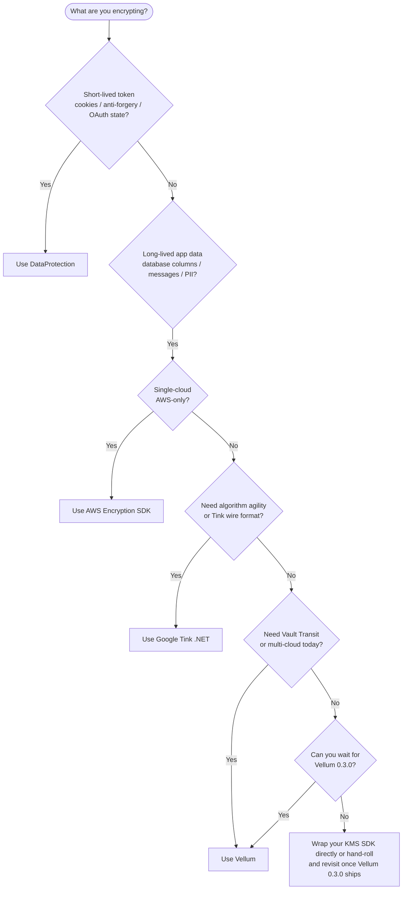

# Comparison

How Vellum sits alongside the four alternatives a .NET team usually evaluates when they need
envelope encryption. This page is deliberately **not** a marketing document — each library
does something well, and the most honest recommendation is often "use one of the others if
it fits". The goal is to help you pick the right tool quickly, and to be clear about the
scenarios where Vellum is explicitly not the best choice.

- **[`Microsoft.AspNetCore.DataProtection`](https://learn.microsoft.com/en-us/aspnet/core/security/data-protection/introduction)** —
  the built-in .NET solution for short-lived payload protection.
- **[AWS Encryption SDK for .NET](https://docs.aws.amazon.com/encryption-sdk/latest/developer-guide/c-language.html)** —
  AWS's client-side envelope encryption library, AWS-centric but supports multi-provider
  keyrings.
- **[Google Tink (.NET port)](https://github.com/google/tink/tree/master/dotnet)** — Google's
  cryptographic library, community-maintained for .NET.
- **Hand-rolled envelope encryption** — what most teams build before discovering any of the
  above.

> **Scope of this page.** Full migration guides from `DataProtection`, AWS Encryption SDK,
> and Tink to Vellum are planned for Sprint 2. This page covers the evaluation-stage
> question only: "which library fits my workload?".

## Feature matrix

| Dimension | Vellum `0.2.0` | `Microsoft.AspNetCore.DataProtection` | AWS Encryption SDK for .NET | Google Tink (.NET) | Hand-rolled |
|---|---|---|---|---|---|
| **Envelope encryption (DEK + KEK)** | Yes, first-class | No (key ring only) | Yes, first-class | Yes, via KMS AEAD primitives | Usually yes |
| **Provider-agnostic KEK backends** | Yes (Vault shipped; Azure KV / AWS KMS / GCP KMS planned `0.3.0`) | No — DataProtection manages its own keyring internally | Yes (AWS KMS + multi-provider keyrings) | Yes (AWS KMS, GCP KMS, HashiCorp Vault via community providers) | Usually single-backend |
| **Storage-agnostic DEK persistence** | Yes (`IEncryptionKeyStore`; EF Core + in-memory shipped) | No — key ring storage is baked in (filesystem, Redis, Azure Blob, …) | Partial — key store hooks exist but most integrations are AWS-centric | Not really — keysets are persisted via `IKeysetReader`/`IKeysetWriter` but the common path is filesystem | Usually yes, by definition |
| **Multi-tenant isolation built-in** | Yes — store, cache, manager layers plus cryptographic scope binding (the scope is AES-GCM associated data on every envelope by default); opaque `Scope` | Partial — purpose strings isolate key derivation, but there is no per-tenant DEK rotation story | Partial — encryption contexts provide AAD binding; tenancy is the consumer's job | No — the consumer builds this on top | Varies |
| **DEK rotation built-in** | Yes (`RotateDekAsync` — atomic and fail-safe), plus the opt-in `Vellum.Rotation` background worker | Yes (automatic key ring rotation every 90 days) | Yes (KMS-side rotation) | Yes (`KeysetManager.Rotate`) | Often missing or ad-hoc |
| **EF Core integration** | Yes, first-class (`Vellum.EntityFrameworkCore`) | No | No | No | Varies |
| **Memory hygiene (explicit zeroing)** | Yes, documented contract; `CryptographicOperations.ZeroMemory` in every finally block | Partial — BCL primitives zero internally, consumer-visible plaintext is the consumer's responsibility | Yes — the SDK zeroes plaintext material keys after use | Yes — Tink primitives zero sensitive state | Depends on the author |
| **Authenticated encryption (AES-GCM)** | Yes, AES-256-GCM only | AES-256-CBC + HMAC-SHA-256 (authenticated) by default | AES-256-GCM with optional additional modes | AES-256-GCM, ChaCha20-Poly1305, AES-EAX | Usually AES-GCM |
| **License** | Apache-2.0 | MIT | Apache-2.0 | Apache-2.0 | — |
| **Active maintenance (as of June 2026)** | Active (`0.2.0` released June 2026) | Active (ships with every .NET release) | Active (AWS owned, regular releases) | Active (Google owned, community .NET port) | You maintain it |
| **Production-ready claim** | Pre-1.0 stable — honest about it; production-validated | Yes, standard in every ASP.NET Core app | Yes, standard in AWS-centric shops | Yes for the primitives; the .NET port lags the Java / Go one | Your tests decide |

## When to pick each one

### Pick `Microsoft.AspNetCore.DataProtection` if…

- …you only need to protect **short-lived payloads**: antiforgery tokens, cookies, TempData,
  password-reset links, OAuth state, anti-CSRF tokens. This is exactly what
  `DataProtection` is optimised for, and it is already in your `Microsoft.AspNetCore.App`
  shared framework — there is nothing to install.
- …your app is a single-process ASP.NET Core deployment and you are comfortable letting
  the framework manage the key ring automatically (filesystem by default, Redis or Azure
  Blob in multi-instance deployments).
- …you do **not** need multi-tenant isolation at the key level. `DataProtection` supports
  purpose strings that isolate key derivation, but the KEK is shared across tenants.

**Do not use `DataProtection` for**: long-lived encrypted database columns, multi-region
compliance scenarios that require a KMS-backed KEK, or workloads where you need to rotate
a per-tenant DEK in response to a tenant-side compromise. `DataProtection` is not built
for those scenarios and trying to retrofit it is painful.

### Pick AWS Encryption SDK for .NET if…

- …you are a single-cloud AWS shop and you are happy to depend on AWS KMS for every
  encryption operation.
- …you need the AWS-specific features: multi-Region keys, grant tokens, master-key-provider
  discovery, AWS-signed audit trails via CloudTrail.
- …you want the raw algorithm-suite granularity that the AWS SDK exposes (e.g. committing
  vs. non-committing suites, required encryption contexts).
- …you have no compelling reason to stay cloud-agnostic.

**Do not use AWS Encryption SDK for**: multi-cloud deployments (you will be rewriting the
DI layer for every non-AWS environment), non-AWS backends (Vault, Azure Key Vault, on-prem
HSM), or scenarios where EF Core integration matters to you.

### Pick Google Tink (.NET) if…

- …you explicitly want the "algorithm agility" guarantees Tink is designed around: the
  library refuses to let you misconfigure a cipher, and the keysets carry their algorithm
  identifiers so rotation to a new primitive is a config change rather than a code change.
- …you are comfortable with the .NET port being a community project that lags Java and Go
  in new features (check `dotnet`'s release cadence on the Tink repo before committing).
- …you have an existing Tink-based Java or Go service and you want a compatible encryption
  format on the .NET side.

**Do not use Tink for**: deployments that need first-class EF Core integration, consumers
who want the library to manage the DEK lifecycle and persistence for them, or teams that
specifically need HashiCorp Vault Transit support (Tink's Vault integration is community-
maintained and less polished than its KMS paths).

### Pick hand-rolled if…

- …you have an existing implementation that works and you do not have bandwidth to migrate.
- …your threat model and scale are so specific that no library matches exactly, and you
  have a dedicated cryptographer reviewing the code.

**Do not hand-roll for**: "we only need a small wrapper around AES-GCM, how hard can it
be?" Hand-rolling typically hides lessons L1 (multi-tenant query filter bypass), L2
(4-layer race defence), L3 (clone-before-return cache hygiene), L13 (value equality on
records with byte arrays), and L24 (cache keying). The fix for each of those lessons cost
several production incidents in one early-adopter's repository before it became clear
that the right answer was "use a library that already solved them".

### Pick Vellum if…

- …you need **envelope encryption** (not short-lived token protection, not raw AEAD
  primitives) for **long-lived application data**.
- …you want **one DI wiring** that works across Vault today and Azure KV / AWS KMS / GCP
  KMS tomorrow, without rewriting your business code.
- …you use **EF Core** and you want the DEK store to live in the same migration pipeline
  as the rest of your schema.
- …you need **multi-tenant isolation** enforced by the library, not by convention, with
  cache-partitioned DEK lookups and scope-verified historical key resolution.
- …you are willing to accept a **pre-1.0 API** that is stable but not yet frozen, in
  exchange for a library that has already been dogfooded through three consumer feedback
  iterations and a production hotfix cycle.

**Do not use Vellum for**: protecting ASP.NET Core cookies (use `DataProtection`),
single-cloud AWS workloads where you would prefer to own the KMS integration directly (use
AWS Encryption SDK), or scenarios where you need a cloud KEK provider today that Vellum
has not shipped yet (implement `IKeyEncryptionProvider` yourself against the cloud SDK, or
wait for `0.3.0`).

## Envelope encryption: the one feature that separates them

If your use case really is "encrypt a database column under a rotatable KEK with an audit
trail", here is how each library handles the envelope format:

| Library | Envelope format | Self-contained? | KeyId required at decrypt? |
|---|---|---|---|
| Vellum | `EncryptedPayload(ciphertext, nonce, wrappedDek, keyId, formatVersion)` — `wrappedDek` is the single source of truth at decrypt time; format version 2 (default) binds the scope as AES-GCM AAD | **Yes** — no store round-trip on decrypt | No, audit only |
| AWS Encryption SDK | Fixed on-wire format (`.html#message-format`) combining ciphertext + encrypted data keys + algorithm suite id | **Yes** — but the format is opinionated and AWS-specific | No (encrypted data keys carry the material) |
| Google Tink | Keyset reference + primitive-specific ciphertext; the keyset lives separately | No — decrypt requires access to the matching keyset | No (keyset id determines the primitive) |
| `DataProtection` | Purpose-stringed ciphertext; key ring managed by the framework | No — decrypt requires the matching key ring | No (key ring id is encoded in the output) |
| Hand-rolled | Usually `(keyId, nonce, ciphertext)` and a side table for wrapped DEKs | **Usually no** — decrypt requires a DB round-trip for the wrapped DEK | **Usually yes** |

Vellum's self-contained envelope is the design that matches AWS Encryption SDK and Tink —
not the one that matches most hand-rolled implementations. If you are migrating from a
hand-rolled `(keyId, ciphertext)` schema, the cleanest migration is to add two nullable
columns for `WrappedCiphertext` and `WrappedProviderVersion` on every encrypted row and
back-fill them from your DEK store via `UPDATE ... FROM JOIN` before dropping the store
lookup on the decrypt path. See
[migrations — from a custom implementation](migrations/from-custom.md) for the full recipe.

## Operational posture

| Dimension | Vellum | `DataProtection` | AWS Encryption SDK | Tink | Hand-rolled |
|---|---|---|---|---|---|
| Startup failure on bad config | Yes — `ValidateOnStart()` on every options type | Yes | Yes | Yes | Depends |
| Fail-closed on KEK outage | Yes — never returns plaintext on error | Yes | Yes | Yes | Depends |
| Structured logs (LoggerMessage source-gen) | Yes, with stable EventIds for SIEM rules | Yes, less granular | Yes | Minimal | Varies |
| Metrics / OpenTelemetry | Not yet (planned `Vellum.AspNetCore`) | Yes (via framework diagnostics) | Yes (AWS SDK metrics) | Partial | Varies |
| Health checks | Not yet (planned `Vellum.AspNetCore`) | Yes, built-in | Yes, via AWS SDK | No | Varies |
| Automated rotation | Yes — opt-in `Vellum.Rotation` background worker (age-gated, per-scope retry); manual `RotateDekAsync` also available | Automatic (90-day default) | KMS-side | `KeysetManager.Rotate` | Usually DIY |

This is the single biggest honesty check for Vellum today: on metrics and health checks,
Vellum is behind the established alternatives. Those gaps are explicitly scoped to the
planned `Vellum.AspNetCore` package. If you need them before then, pick a different
library or carry the workarounds yourself.

## Summary decision tree

## External references

- [`Microsoft.AspNetCore.DataProtection` — Introduction](https://learn.microsoft.com/en-us/aspnet/core/security/data-protection/introduction)
- [AWS Encryption SDK — Developer Guide](https://docs.aws.amazon.com/encryption-sdk/latest/developer-guide/introduction.html)
- [AWS Encryption SDK for .NET — API Reference](https://docs.aws.amazon.com/encryption-sdk/latest/developer-guide/dotnet.html)
- [Google Tink — Main repository](https://github.com/google/tink)
- [Tink .NET — subdirectory](https://github.com/google/tink/tree/master/dotnet)
- [HashiCorp Vault — Transit secrets engine](https://developer.hashicorp.com/vault/docs/secrets/transit)
- [AWS KMS — Developer Guide](https://docs.aws.amazon.com/kms/latest/developerguide/overview.html)
- [Azure Key Vault — Keys documentation](https://learn.microsoft.com/en-us/azure/key-vault/keys/about-keys)
- [Google Cloud KMS — Encrypt and decrypt with Cloud KMS keys](https://cloud.google.com/kms/docs/encrypt-decrypt)
